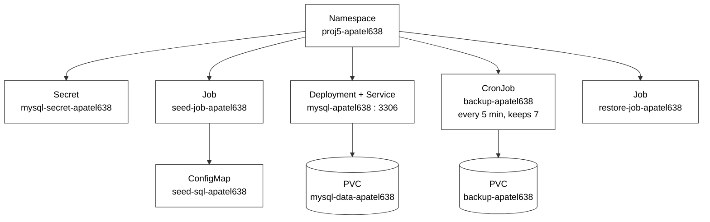

# CLO835 Project 5 - Backup and Restore Lifecycle

Student ID: apatel638

## What this is

- MySQL database running in a local kind (Kubernetes-in-Docker) cluster
- A CronJob takes a timestamped, compressed backup every 5 minutes, keeps only the last 7
- A restore Job can reload any one backup exactly
- Goal: be able to look at a backup's timestamp, compare it to when each row was added, and
  predict exactly what will/won't survive a restore, before running it
- Raw Kubernetes YAML only - no Helm, no kustomize, no managed cloud services
- `bootstrap.sh` rebuilds every resource below from a clean host in under 2 minutes

## Architecture - every resource in the cluster



Relationships not drawn above, to keep the diagram readable:

- `mysql-secret-apatel638` provides the root password to the MySQL Deployment, the CronJob,
  the seed Job, and the restore Job - all four, not just the ones it's connected to above
- Everything that talks to the database (seed Job, CronJob, restore Job) reaches it through
  the Service DNS name `mysql-apatel638`, never a pod IP, since pod IPs change on restart
- `restore-job-apatel638` reads from `backup-apatel638`, the same PVC the CronJob writes to -
  they're drawn separately above only because drawing that connection would cross the
  database branch on the diagram
- `mysql-data-apatel638` (the data PVC) and `backup-apatel638` (the backup PVC) are
  deliberately separate volumes; the MySQL Deployment never mounts the backup PVC, so a
  failure on the data disk can't also destroy the backups meant to protect against it

## What's not in the diagram, and why

- `bootstrap.sh` - not a cluster resource, it's the script that creates everything above.
  Diagrams show what's running; this is what builds it.
- `runbook.md` - documentation of exact commands, not infrastructure
- `evidence/weekly-dumps/` - dated backup files kept as proof of the project's timeline
- `kind-config.yaml` - defines the cluster and its two nodes, one level below the namespace
  shown here
- `list-backups-pod.yaml` / `backup-helper-pod.yaml` - short-lived helper pods spun up
  manually to list or inspect backup contents; not part of the always-running system

## Repo layout

- `kind-config.yaml` - cluster definition (1 control-plane, 1 worker)
- `manifests/` - namespace, secret template, both PVCs, MySQL Deployment + Service, seed
  ConfigMap/Job, backup CronJob, restore Job, two helper pods
- `bootstrap.sh` - full stand-up from a clean host
- `runbook.md` - exact commands for every operational procedure
- `evidence/weekly-dumps/` - dated backup files, committed as the project progressed
- `README.md` - this file

## Quick start

```bash
./bootstrap.sh
kubectl get pods,pvc,cronjob,svc -n proj5-apatel638
```

Everything else is in `runbook.md`.

## Design decisions

- **Two separate PVCs** - a backup on the same disk as the data it protects is worthless if
  that disk fails
- **`set -e` before rotation in the CronJob** - if `mysqldump` fails, the script stops before
  rotation runs, so a failed backup can never delete good old backups
- **Restore drops the table first** - a dump file is just `INSERT` statements; without
  dropping the table, a restore would layer new rows on top of what's already there instead
  of giving an exact point-in-time state
- **`BACKUP_FILE` is a single env var in restore-job.yaml** - swapping which backup to
  restore is a one-line change (Jobs are immutable, so the old Job object must be deleted
  before re-applying)
- **bootstrap.sh waits for MySQL twice** - once via `kubectl wait --for=condition=Available`,
  then again with a ping-retry loop, since the Deployment reported "Available" a few seconds
  before MySQL actually accepted connections during testing
