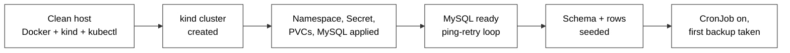
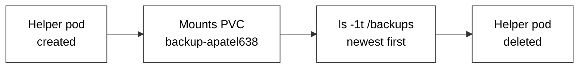
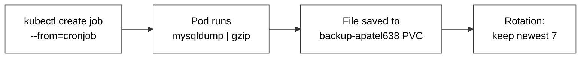
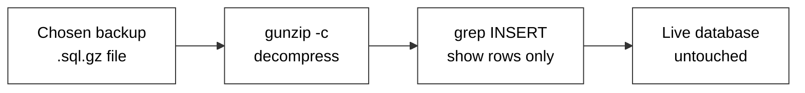
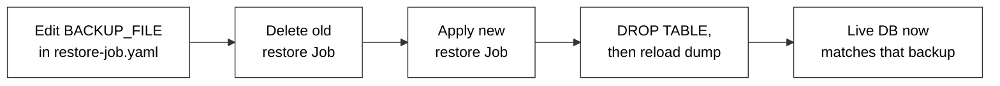
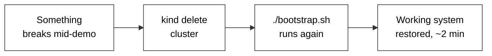

# Runbook - Project 5 (apatel638)

Every command below has actually been run and tested against the real cluster. Passwords
shown are the one used in this project (`ClO835Pass!apatel638`) - swap in your own if you
rebuild with a different secret. Each section has a small diagram showing what's actually
happening when you run it, not just the commands themselves.

---

## 1. Bootstrap from nothing

What this does: rebuilds the entire system, in order, on a machine that has nothing but
Docker, kind, kubectl, and git.



```bash
./bootstrap.sh
```

Verify the cluster, MySQL, and CronJob are healthy:

```bash
kubectl get pods,pvc,cronjob -n proj5-apatel638
```

---

## 2. List current backups, newest first

What this does: a short-lived pod mounts the same backup PVC the CronJob writes to, and
lists what's on it - no restore happens here, this is read-only.



```bash
kubectl apply -f manifests/backup-helper-pod.yaml
sleep 5
MSYS_NO_PATHCONV=1 kubectl exec -n proj5-apatel638 backup-helper-apatel638 -- ls -1t /backups
```

Clean up the helper pod when done:

```bash
kubectl delete pod backup-helper-apatel638 -n proj5-apatel638
```

---

## 3. Trigger an immediate backup

What this does: manually fires one run of the same job the CronJob would run on its own
schedule - dump, gzip, save, then rotate anything past the 7 newest.



```bash
kubectl create job --from=cronjob/backup-apatel638 manual-backup-<NAME> -n proj5-apatel638
kubectl get pods -n proj5-apatel638
kubectl logs job/manual-backup-<NAME> -n proj5-apatel638
```

Replace `<NAME>` with anything unique, e.g. `manual-backup-demo1`.

---

## 4. Inspect a backup's contents without restoring it

What this does: reads the rows inside a specific backup file directly, without touching
the live database at all. This is what makes predicting the restore outcome possible.



```bash
kubectl apply -f manifests/backup-helper-pod.yaml
sleep 5
MSYS_NO_PATHCONV=1 kubectl exec -n proj5-apatel638 backup-helper-apatel638 -- sh -c "gunzip -c /backups/<FILENAME> | grep INSERT"
kubectl delete pod backup-helper-apatel638 -n proj5-apatel638
```

---

## 5. Insert a new dated row into the live database

What this does: adds one row directly to the running MySQL pod - this is how the project's
"data grows over time" requirement is satisfied.


```bash
kubectl exec -it -n proj5-apatel638 deploy/mysql-apatel638 -- mysql -uroot -p'ClO835Pass!apatel638' -e "INSERT INTO clo835db.records (student_id, note, added_on) VALUES ('apatel638','<NOTE>','<YYYY-MM-DD>');"
```

---

## 6. Run the restore Job against a named backup

What this does: reloads one specific backup file exactly - the table is dropped first, so
the result is that backup's exact state, not a merge with whatever was already there.



Jobs are immutable once created, so any previous restore Job needs to be deleted first:

```bash
kubectl delete job restore-job-apatel638 -n proj5-apatel638 --ignore-not-found
kubectl apply -f manifests/restore-job.yaml
kubectl logs -n proj5-apatel638 job/restore-job-apatel638
```

Verify the result:

```bash
kubectl exec -it -n proj5-apatel638 deploy/mysql-apatel638 -- mysql -uroot -p'ClO835Pass!apatel638' -e "SELECT * FROM clo835db.records ORDER BY added_on;"
```

---

## 7. Prove rotation (before / after)

What this does: shows the file count on the backup PVC never exceeds 7 - a new backup
pushes out the oldest one, it doesn't just accumulate forever.


List backups before triggering a new one (see step 2), note the count and the oldest
filename. Trigger a new backup (see step 3). List backups again:

```bash
kubectl apply -f manifests/backup-helper-pod.yaml
sleep 5
MSYS_NO_PATHCONV=1 kubectl exec -n proj5-apatel638 backup-helper-apatel638 -- ls -1t /backups
kubectl delete pod backup-helper-apatel638 -n proj5-apatel638
```

Confirm the count is still capped at 7, the oldest file from the "before" list is gone,
and the new file is present.

---

## 8. Tear down and rebuild if something goes wrong mid-demo

What this does: if anything breaks live during the demo, this wipes the cluster completely
and rebuilds it from the same repo, using the same script that was already tested.



```bash
kind delete cluster --name backup-apatel638
./bootstrap.sh
```
